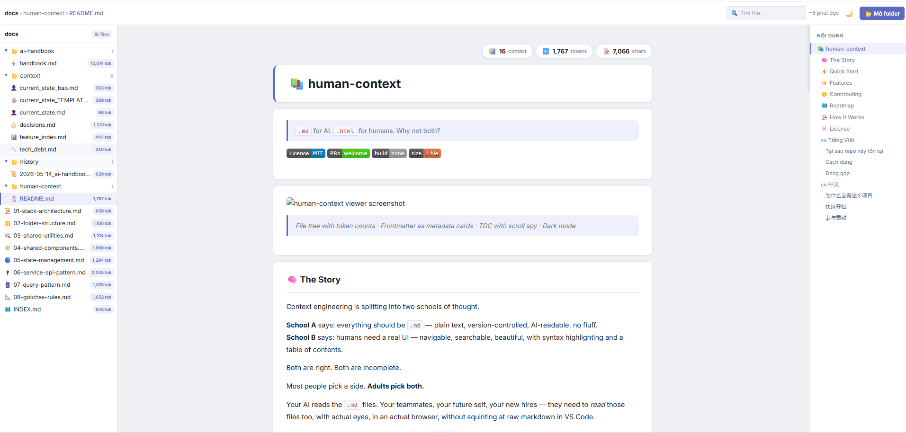

# 📚 human-context

> `.md` for AI. `.html` for humans. Why not both?

[](./LICENSE)
[](https://github.com/zzgiabaozzbui/human-context/pulls)
[](https://github.com/zzgiabaozzbui/human-context)
[](./md-folder-viewer.html)

---



> *File tree with token counts · Frontmatter as metadata cards · TOC with scroll spy · Dark mode*

---

## 🧠 The Story

Context engineering is splitting into two schools of thought.

**School A** says: everything should be `.md` — plain text, version-controlled, AI-readable, no fluff.  
**School B** says: humans need a real UI — navigable, searchable, beautiful, with syntax highlighting and a table of contents.

Both are right. Both are incomplete.

Most people pick a side. **Adults pick both.**

Your AI reads the `.md` files. Your teammates, your future self, your new hires — they need to *read* those files too, with actual eyes, in an actual browser, without squinting at raw markdown in VS Code.

**human-context** is the missing half. A single `.html` file you drop into any project. Open it in Chrome, point it at your folder, and instantly get a proper reading experience for every `.md` file in your codebase — file tree, syntax highlighting, TOC, cross-file navigation, dark mode, and token counts so you know exactly how much context you're feeding your AI.

No server. No `npm install`. No build step. One file.

---

## ⚡ Quick Start

**1.** Download [`md-folder-viewer.html`](./md-folder-viewer.html)

**2.** Open it in Chrome or Edge (double-click the file)

**3.** Click **Open Folder** → select your project folder

That's it. Your folder becomes a navigable knowledge base.

> **Firefox users:** supported via file picker fallback, but folder memory won't persist between sessions (Firefox doesn't support the File System Access API).

---

## ✨ Features

- **🌲 File tree** — auto icons by filename and folder, collapsible, keyboard-friendly
- **📊 Token counts** — per-file token / char / heading stats in the tree and content panel
- **🃏 Frontmatter cards** — YAML `---` blocks rendered as structured metadata, not raw text
- **🎨 Syntax highlighting** — via highlight.js, light and dark themes
- **📋 Table of contents** — auto-generated, scroll spy, smooth scroll
- **🔗 Cross-file navigation** — click `.md` links inside content to navigate between files
- **🃏 Section cards** — H2 blocks wrapped in visual cards for easier scanning
- **🔍 Search** — filter the file tree in real time
- **🌙 Dark mode** — persisted in localStorage
- **💾 Folder memory** — IndexedDB remembers your last folder, reopens it automatically on next visit
- **📱 Responsive** — tree panel collapses on mobile with hamburger toggle

Also included: [`md-reader.html`](./md-reader.html) — the simpler single-file version (drag & drop one `.md` file, no folder needed).

---

## 🤝 Contributing

This is **one HTML file**. You can read the entire codebase in 30 minutes and understand every line. That's the point.

If you've ever wanted to contribute to open source but felt intimidated by monorepos, build pipelines, and 47-step setup guides — this is for you.

**Good first contributions:**

- Add a new file icon pattern in `getIcon()`
- Add a new heading icon pattern in `HEADING_ICONS[]`
- Improve dark mode contrast or spacing
- Add a new language to this README
- Fix a bug you found (the code is right there)
- Improve mobile layout

**How to contribute:**

1. Fork the repo
2. Open `md-folder-viewer.html` in a text editor
3. Make your change
4. Test it by opening the file in Chrome
5. Open a PR with a short description of what you changed and why

No tests to run. No CI to wait for. No environment to set up.

If you improve it — please push back. That's how this gets better for everyone.

---

## 🗺️ Roadmap

These are things not yet built. Any of them would make a great PR:

- [ ] Keyboard navigation (`j` / `k` to move between files)
- [ ] Support `.txt`, `.rst`, `.mdx`
- [ ] Export folder as a static site (offline-ready HTML bundle)
- [ ] Print / PDF mode
- [ ] Word count alongside token count
- [ ] Customizable icon sets (bring your own emoji map)
- [ ] Inline image support for local project images
- [ ] Better mobile experience

Have an idea not on this list? Open an issue or just build it.

---

## 🏗️ How It Works

```text
md-folder-viewer.html
│
├── File System Access API  → showDirectoryPicker() [Chrome/Edge]
├── webkitdirectory input   → fallback for Firefox
├── marked.js (CDN)         → markdown parsing
├── highlight.js (CDN)      → syntax highlighting
├── IndexedDB               → folder handle persistence across sessions
└── CSS custom properties   → full light/dark design system, no framework
```

Everything runs client-side. Nothing is sent anywhere. Your files never leave your machine.

---

## 📄 License

MIT — do whatever you want, just keep the copyright notice. See [LICENSE](./LICENSE).

---

Made by [chillchill](https://github.com/zzgiabaozzbui) · If this helped you, give it a ⭐

---
---

## 🇻🇳 Tiếng Việt

### Tại sao repo này tồn tại

Context engineering đang có 2 trường phái:

- **Phe `.md`**: tất cả nằm trong file markdown — AI đọc được, git-friendly, không phụ thuộc tool nào.
- **Phe `.html`**: con người cần giao diện thật — điều hướng được, tìm kiếm được, đẹp mắt.

Cả hai đều đúng. Cả hai đều thiếu.

Đa số người chọn một trong hai. **Người lớn chọn cả hai.**

AI của bạn đọc file `.md`. Nhưng đồng nghiệp, người mới vào nhóm, và chính bạn sau 3 tháng — cần đọc bằng mắt người thật, trong trình duyệt thật, không phải nhìn chằm chằm vào raw markdown.

**human-context** là nửa còn thiếu đó. Một file `.html` duy nhất. Mở lên, chọn folder, đọc. Không cần server, không cần cài gì.

### Cách dùng

1. Tải [`md-folder-viewer.html`](./md-folder-viewer.html)
2. Mở bằng Chrome hoặc Edge
3. Bấm **Open Folder** → chọn folder dự án

### Đóng góp

File này chỉ có ~1 file HTML. Bạn có thể đọc hết code trong 30 phút.

Nếu bạn sửa được gì hay hơn — hãy push lên. Không cần setup, không cần cài npm, không cần CI. Sửa file, test trên browser, mở PR.

Dự án này phát triển được là nhờ mọi người cùng cải tiến.

---

## 🇨🇳 中文

### 为什么会有这个项目

上下文工程（Context Engineering）正在分裂成两个流派：

- **Markdown 派**：所有内容保存为 `.md` 文件 —— AI 可读、版本可控、零依赖。
- **HTML 派**：人类需要真正的界面 —— 可导航、可搜索、有语法高亮和目录。

两者都对。两者都不完整。

大多数人选其一。**成熟的开发者两个都要。**

你的 AI 读 `.md` 文件。但你的队友、新成员、三个月后的你自己——需要用真实的眼睛，在真实的浏览器里阅读这些文件。

**human-context** 就是缺失的那一半。一个单独的 `.html` 文件，放进任何项目。打开浏览器，选择文件夹，立即获得完整的阅读体验。无需服务器，无需 `npm install`，无需构建步骤。

### 快速开始

1. 下载 [`md-folder-viewer.html`](./md-folder-viewer.html)
2. 用 Chrome 或 Edge 打开
3. 点击 **Open Folder** → 选择你的项目文件夹

### 参与贡献

这只是一个 HTML 文件。你可以在 30 分钟内读完全部代码。

如果你改进了它 —— 请提交 PR。无需配置环境，无需安装依赖。修改文件，在浏览器中测试，提交 PR 即可。

欢迎任何形式的贡献：新图标、Bug 修复、翻译、UI 改进。
